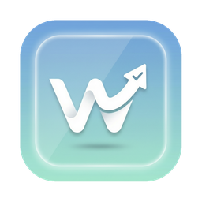

<p align="center">
  
</p>

<h1 align="center">Activity Review</h1>

<p align="center">
  <strong>A local-first work activity recorder for individuals.</strong>
</p>

<p align="center">
  <a href="./README.md">简体中文</a> · <a href="./README.tw.md">繁體中文</a> · <a href="./README.en.md">English</a>
</p>

<p align="center">
  <a href="https://github.com/lumia1998/Acticity_Review/releases/latest">
    
  </a>
  
  
  
</p>

---

Activity Review continuously records the apps you use, websites you visit, active windows, and screen context during the day, then turns those fragments into a **reviewable, queryable, and reusable** work trail.

- No manual check-ins
- Overview, timeline, daily report, and assistant all share the same local data
- You can jump from aggregate stats to concrete pages, titles, and screenshots
- Supports Simplified Chinese, English, and Traditional Chinese UI, with daily reports generated and switched per current locale
- Supports lightweight mode, hourly activity views, Markdown report export, and multi-display screenshot strategies
- Includes `Desktop Avatar Beta` for lightweight presence feedback while you work

> All data stays local by default. AI features are optional.

---

## What It Is

This is not a traditional attendance app, and not just another dashboard that piles up time numbers.

Activity Review is closer to a personal work-trace system:

- Capture work context automatically: apps, websites, screenshots, OCR text, and hourly summaries
- Answer practical questions: “What did I do today?” or “What has been the main focus this week?”
- Designed for recall and review, not surveillance

---

## Core Capabilities

### Automatic Tracking

| Dimension | Description |
|---------|------|
| App tracking | Detects the foreground app and records duration, titles, and categories |
| Website tracking | Captures browser URLs and aggregates by browser, domain, and page |
| Screen trail | Takes screenshots, extracts OCR text, and supports active-display or full-desktop capture |
| Idle detection | Uses both input and screen changes to reduce false working time |
| Historical replay | Reconstructs the day through a timeline with context |

### Analysis

| Capability | Description |
|-----|------|
| Work assistant | Answers questions based on your actual local records |
| Time-range understanding | Understands “yesterday”, “this week”, or “last 3 days” |
| Session grouping | Groups fragmented actions into longer work sessions |
| Todo extraction | Pulls likely follow-up items from pages, titles, and context |
| Daily report | Generates structured reports with history view, hourly activity summaries, Markdown export, and locale-aware report switching |
| Dual response modes | Choose between stable templates and AI-enhanced output |
| Desktop Avatar Beta | Shows lightweight state feedback such as working, reading, meeting, music, video, and generating |

### Privacy

- Per-app `normal / anonymize / ignore`
- Sensitive keyword filtering
- Domain blacklist
- Pause on screen lock
- Manual pause / resume

### Control

- Lightweight mode: close the main window and keep only background tracking plus tray
- Reclassify app defaults directly from timeline details
- Migrate local data to another directory and clean old managed data afterward

---

## Screenshots

### Today Overview


The overview page combines total duration, work duration, browser usage, website access, hourly activity patterns, and app distribution in one place.

### Assistant


The assistant answers directly from your local records and is useful for recap, summaries, and todo extraction.

### Desktop Avatar Beta


The desktop avatar floats on the desktop and gives lightweight state feedback instead of acting as a full information panel.

---

## Pages

| Page | Purpose |
|------|-------|
| **Overview** | Aggregated totals, work duration, browser usage, websites, hourly activity, and app distribution |
| **Timeline** | Replay windows, screenshots, OCR, and visited pages by time |
| **Assistant** | Ask natural-language questions against your recorded work trail |
| **Report** | Generate, review, switch, and export daily reports based on the current UI language |
| **Settings** | Manage tracking, privacy, AI, avatar, lightweight mode, storage, and updates |

---

## AI

The core of Activity Review is still **local recording**. AI is there to make those records easier to read, search, and review.

| Mode | Description |
|------|------|
| **Template** | Works out of the box with stable structured output |
| **AI Enhanced** | Uses your own model service for more natural summaries and answers |

Supported providers: Ollama, OpenAI-compatible APIs, DeepSeek, Qwen, Zhipu, Kimi, Doubao, MiniMax, SiliconFlow, Gemini, and Claude.

> The Ollama provider can refresh locally installed model lists directly, while still allowing manual model input as a fallback when needed.

---

## Installation

Download the latest build from [Releases](https://github.com/lumia1998/Acticity_Review/releases/latest).

| Platform | Package |
|------|--------|
| macOS Apple Silicon | `.dmg` |
| macOS Intel | `.dmg` |
| Windows | `.exe` |
| Linux (X11 / Mainstream Wayland) | `.deb` / `.AppImage` |

### Linux Dependencies

Base dependencies:

```bash
sudo apt install xprintidle tesseract-ocr
```

Additional X11 dependencies:

```bash
sudo apt install xdotool x11-utils
```

X11 screenshot tools, install at least one:

```bash
sudo apt install scrot
# or
sudo apt install maim
sudo apt install imagemagick
```

Common Wayland providers / tools:

```bash
# GNOME
gdbus

# KDE Plasma
kdotool

# Sway
swaymsg

# Hyprland
hyprctl

# Wayland screenshot tools, install at least one
grim / gnome-screenshot / spectacle
```

> Linux now supports X11 and a mainstream Wayland provider chain (GNOME / KDE Plasma / Sway / Hyprland).
> Browser URL recovery on Linux is now best-effort:
> Firefox-family browsers (Firefox / Zen / LibreWolf / Waterfox) prefer sessionstore recovery;
> Chromium-family browsers still rely mainly on title extraction plus recent-record fallback.

---

## Tech Stack

| Layer | Technology |
|------|------|
| Desktop host | Python + PyWebView |
| Backend API | FastAPI |
| Frontend | Svelte 4 + Vite |
| Styling | Tailwind CSS |
| Storage | SQLite |

---

## Development

```bash
npm install
python -m uvicorn backend.app.main:app --host 127.0.0.1 --port 8000 --reload
python -m desktop.main
```

Requires Node.js 18+ and Python 3.11+.

```text
src/                  Svelte frontend
src/routes/           Pages (overview / timeline / assistant / report / settings)
src/lib/              Components, stores, utilities
backend/app/          FastAPI backend (stats, timeline, config, runtime, assistant)
desktop/              Python desktop host (PyWebView startup and window bridge)
```

---

## Related Docs

- [CHANGELOG.md](CHANGELOG.md)
- [docs/WINDOWS_OCR.md](docs/WINDOWS_OCR.md)

## License

MIT

---

## Star History

<a href="https://www.star-history.com/#lumia1998/Acticity_Review&Date">
  <picture>
    <source
      media="(prefers-color-scheme: dark)"
      srcset="https://api.star-history.com/svg?repos=lumia1998/Acticity_Review&type=Date&theme=dark"
    />
    <source
      media="(prefers-color-scheme: light)"
      srcset="https://api.star-history.com/svg?repos=lumia1998/Acticity_Review&type=Date"
    />
    
  </picture>
</a>
